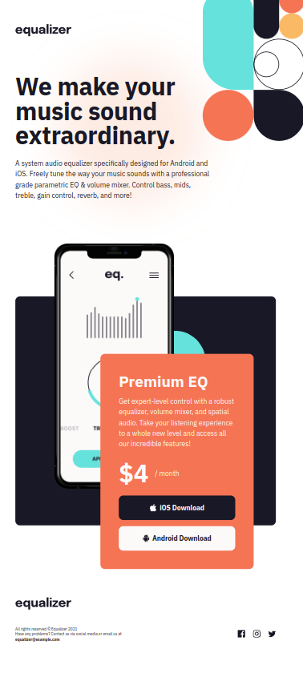

# Frontend Mentor - Equalizer landing page solution

This is a solution to the [Equalizer landing page challenge on Frontend Mentor](https://www.frontendmentor.io/challenges/equalizer-landing-page-7VJ4gp3DE). Frontend Mentor challenges help you improve your coding skills by building realistic projects.

## Table of contents

- [Overview](#overview)
  - [The challenge](#the-challenge)
  - [Screenshot](#screenshot)
  - [Links](#links)
- [My process](#my-process)
  - [Built with](#built-with)
  - [What I learned](#what-i-learned)
  - [Continued development](#continued-development)
  - [Useful resources](#useful-resources)
- [Author](#author)
- [Acknowledgments](#acknowledgments)

## Overview

### The challenge

Users should be able to:

- View the optimal layout depending on their device's screen size
- See hover states for interactive elements

### Screenshot

### Links

- Solution URL: [Frontend Mentor | Equalizer landing page](https://your-solution-url.com)
- Live Site URL: [Equalizer landing page](https://sasanqc.github.io/equalizer-landing-page/)

## My process

### Built with

- Semantic HTML5 markup
- CSS custom properties
- CSS Grid
- Desktop-first workflow

### What I learned

I used grid for responsiveness.

### Continued development

### Useful resources

## Author

- Github - [@sasanqc](https://github.com/sasanqc/)
- Frontend Mentor - [@sasanqc](https://www.frontendmentor.io/profile/sasanqc)
- Twitter - [@sasanqc](https://www.twitter.com/sasanqc)
- Linkedin - [@sasanqc](https://www.linkedin.com/in/sasanqc)

## Acknowledgments
